# Jarkom_Modul1_Lapres_D02
## Laporan Resmi Praktikum Modul 1 Jaringan Komputer 2020
**Kelompok D02**

-Calvin Wijaya 05111840000086

-Alie Husaini R. 05111840000097

##### Nomor 1
Sebutkan webserver yang digunakan pada "testing.mekanis.me"!

```
http.host == testing.mekanis.me
```
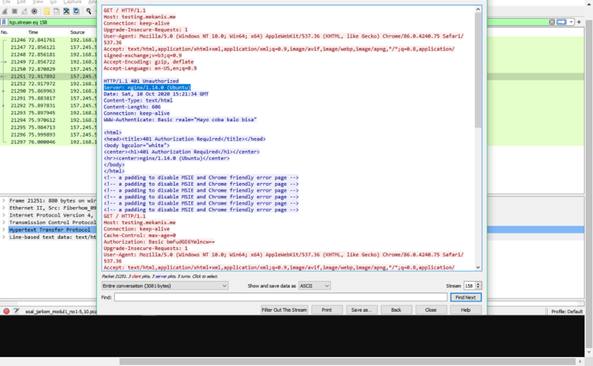

##### Nomor 2
Simpan gambar "Tim_Kunjungan_Kerja_BAKN_DPR_RI_ke_Sukabumi141436.jpg"!

```
Export Objects > HTTP > Search "TIM"
```
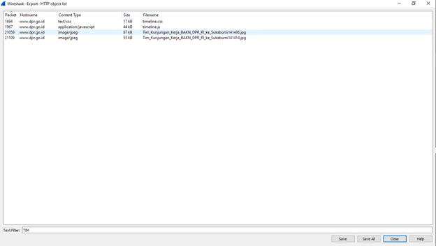
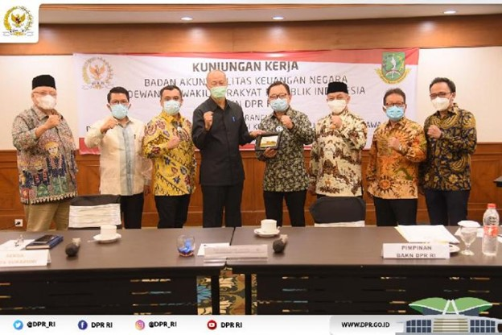

##### Nomor 3
Cari username dan password ketika login di "ppid.dpr.go.id"!

```
http.request.method == POST
```

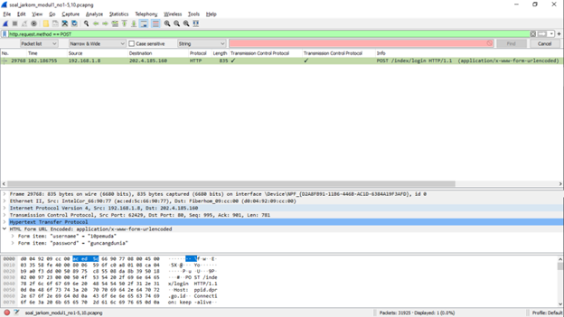

##### Nomor 4
Temukan paket dari web-web yang menggunakan basic authentication method!

```
http.authorization contains Basic
```
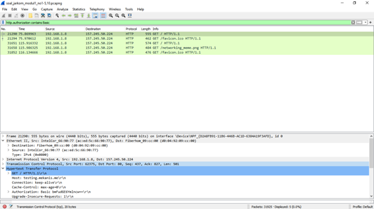

##### Nomor 5
Ikuti perintah di aku.pengen.pw! Username dan password bisa didapatkan dari file .pcapng!

```
http.host == aku.pengen.pw
```
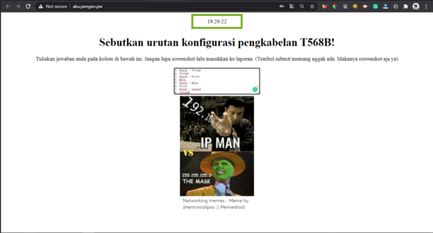

##### Nomor 6
Seseorang menyimpan file zip melalui FTP dengan nama "Answer.zip". Simpan dan Buka file "Open This.pdf" di Answer.zip. Untuk mendapatkan password zipnya, temukan dalam file zipkey.txt (passwordnya adalah isi dari file txt tersebut).

```
ftp-data contains Answer.zip
```
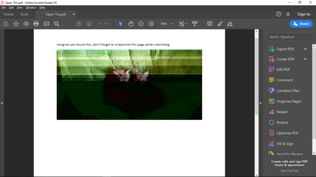

##### Nomor 7
Ada 500 file zip yang disimpan ke FTP Server dengan nama 1.zip, 2.zip, ..., 500.zip. Salah satunya berisi pdf yang berisi puisi. Simpan dan Buka file pdf tersebut. Your Super Mega Ultra Rare Hint = nama pdf-nya "Yes.pdf"

```
ftp-data
```
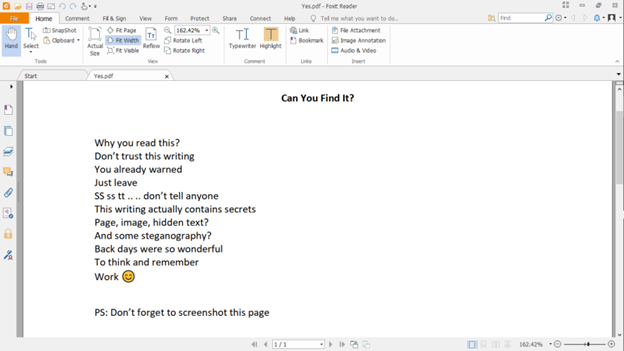

##### Nomor 8
Cari objek apa saja yang didownload (RETR) dari koneksi FTP dengan Microsoft FTP Service!

```
ftp.request.command == RTER (hanya yang Readme)
```
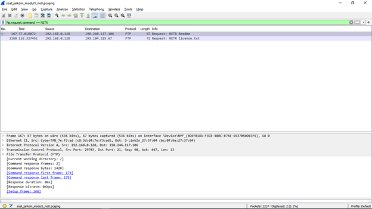
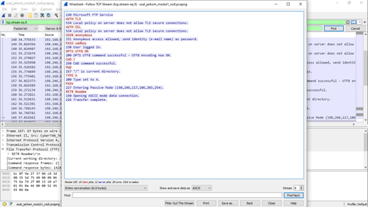

##### Nomor 9
Cari username dan password ketika login FTP pada localhost!

```
ftp.request.command == USER || ftp.request.command == PASS
```

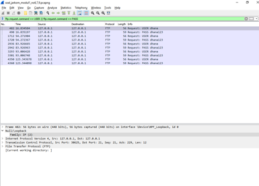

##### Nomor 11
Filter sehingga wireshark hanya mengambil paket yang mengandung port 21!

```
port 21
```
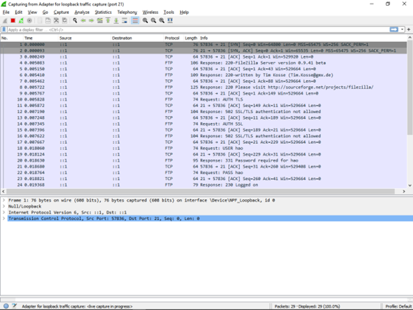

##### Nomor 12
Filter sehingga wireshark hanya mengambil paket yang berasal dari port 80!

```
src port 80
```

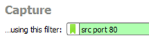

##### Nomor 13
Filter sehingga wireshark hanya menampilkan paket yang menuju port 443!

```
dst port 443
```
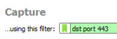

##### Nomor 14
Filter sehingga wireshark hanya mengambil paket yang berasal dari ip kalian!

```
ip src 192.168.43.199
```
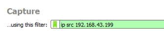]
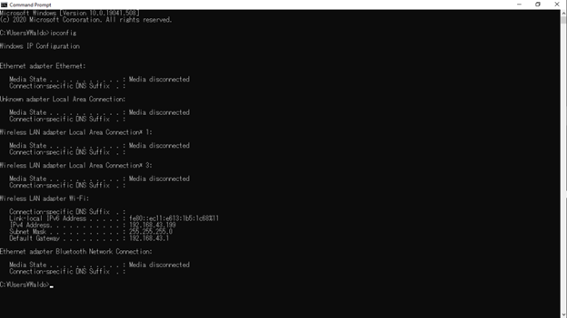

##### Nomor 15
Filter sehingga wireshark mengambil paket yang tujuannya ke monta.if.its.ac.id

```
dst host monta.if.its.ac.id
```
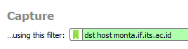
